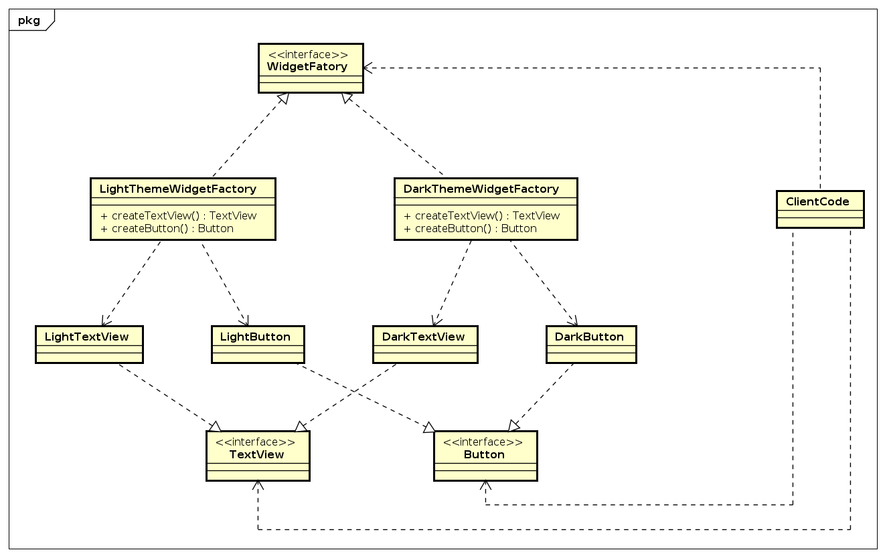

# Factory pattern

__Factory pattern giúp hỗ trợ quá trình tạo instance của object đơn giản hơn.__

## I. Factory Method

### 1. Context sử dụng Factory Method

- Giả sử hệ thống có nhiều object cùng loại, có chung chức năng như các hệ thống Log hoặc Database.
- Ta lấy ví dụ với hệ thống Log.
  - Khi đang trong quá trình develop thì ta sẽ muốn log ra các tool log viewer để có thể debug trong thời gian thực, giúp đỡ quá trình develop hay fix bug đơn giản hơn.
  - Tuy nhiên sau khi đưa lên product thì việc lấy log thời gian thực như vậy lại là thừa và có thể gây ảnh hưởng lớn đến hệ thống. Lúc này ta cần có cơ chế quản lý log khác như log ra file hoặc save log theo cơ chế lazy, để ưu tiên các hoạt động khác.
  - Hoặc đơn giản là tùy vào module mà ta có thể đẩy log vào các hệ thống khác nhau.

  ==> Nếu ta phải làm thủ công cho việc ở từng vị trí đặt log mà gọi hàm log tương ứng thì khả năng sai sót sẽ rất cao. Đó là chưa kể có trường hợp để làm đúng yêu cầu lại phải đặt điều kiện if-else để chọn hệ thống log tương ứng. Điều này lại càng làm giảm effort của hệ thống, gây ảnh hưởng lớn hơn đến người dùng

  ===> __Factory method sẽ giúp xử lý bài toán này một cách hiệu quả hơn__

### 2. Advantage của Factory Method

- Tách biệt việc tạo instance khởi nơi sử dụng, nơi sử dụng chỉ cần tập trung vào logic, không cần để ý đến quá trình khởi tạo instance, không cần biết instance tạo ra từ class nào
- Giảm thiểu sự phụ thuộc của client code - __Lose Coupling__
- Dễ maintain: khi cần maintain hay upgrade thì chỉ cần sửa lại các class của instance, không ảnh hưởng đến code của client.

### 3. Cách sử dụng Factory Method

- Tạo interface chung cho mỗi loại object
- Viết method tạo instance dựa trên type được truyền vào hoặc get ra từ tình trạng hệ thống (đây chính là lý do pattern này được gọi là __Factory method__))

## 2. Abstract Factory

### 1. Context sử dụng Abstract Factory

- Nếu ứng dụng của ta cần một họ các loại đối tượng chia nhiều nhánh khác nhau. Với ví dụ làm UI cho dễ hiểu, ta có các loại widget là các loại UI như TextView, Button, Scrollbar, ... Mỗi loại widget lại có các kiểu Light, Dark, Flatten, ...
- Việc khởi tạo thủ công từng object lúc này rất là tốn effort, chưa kể còn gây sai sót hoặc bất đồng bộ giữa các kiểu giao diện khác nhau.

### 2. Advantage của Abstract Factory

-

### 3. Cách sử dụng Abstract Factory

- Về cơ bản thì cách thức thực hiện cũng giống Factory Method. Tuy nhiên vì ta có các kiểu UI khác nhau nên class Factory ta không viết cụ thể mà khai báo như một Abstract class.
- Sau đó với mỗi loại UI, ta tạo ra một Factory class cụ thể cho chúng theo kiểu Factory method

### 4. Khi nào thì cần Abstract Factory

- Ứng dụng vào những hệ thống mà các thành phần có mối quan hệ họ-hàng-hang-hốc dây mơ rễ má với nhau. Ví dụ như yêu cầu bên trên, ta có các widget là Button, TextView,... Các widget này có kiểu Dark, Light, Flatten,... Rồi chúng có thể nằm trong các platform khác Window, Linux, MacOS, Android ...
- Một họ các thành phần liên quan, được thiết kế để sử dụng nhất quán.
- Muốn tách biệt phần sử dụng logic và khởi tạo instance để nâng cao tính tái sử dung (reusability) và dễ sửa chữa (maintainability)

Tham khảo:

- <https://cppdeveloper.com/design-patterns/design-patterns-3-factory-pattern/>
- <https://cppdeveloper.com/design-patterns/design-patterns-3-factory-pattern-phan-2-abstract-factory/>
