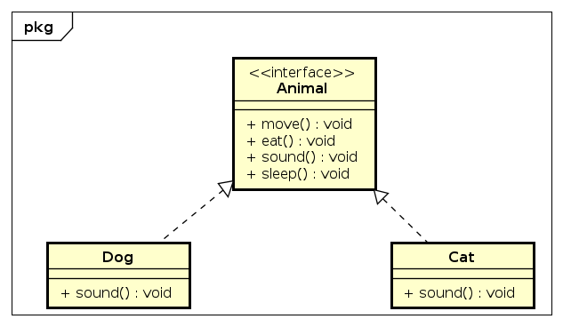

# Template

## 1. Context

Trong nhiều trường hợp, các kiểu dữ liệu có sự định nghĩa lại một vài tính năng để tạo ra các chức năng khác nhau. Còn lại sẽ vẫn có cách thức hoạt động chung giống nhau. Lấy ví dụ đơn giản về việc khai báo kiểu dữ liệu con chó (Dog) chẳng hạn. Con chó trong một ngày có thể có các hoạt động đi, đứng, ăn, ngủ, kêu, ...
Tuy nhiên trong chương trình của chúng ta có thể có thêm con mèo (Cat). Con mèo cũng có các hoạt động ăn, ngủ, đi, đứng giống con chó, chỉ có tiếng kêu của nó là khác. Nếu theo cách cơ bản thì ta sẽ phải định nghĩa lại tất cả các hành động của con mèo, kể cả những chỗ giống với con chó.
Nếu khi này ta có một kiểu dữ liệu chung giữa 2 con vật thì ta sẽ chỉ cần định nghĩa lại những chỗ khác nhau. Hoặc kể cả là chúng có khác nhau tất cả thì cũng chỉ là về chi tiết, còn các hành động thì đều có. Lúc này ta có thể sử dụng Template để định nghĩa những thuộc tính hay phương thức chung cho các con vật, sau đó ta sẽ sửa lại chi tiết ở từng con vật mà không cần phải làm lại những thứ đã có.

## 2. Advantage

- Dùng lại được code có sẵn, không tạo ra code thừa, code trùng lặp gây khó khăn cho quá trình maintain sau này
- Người dùng chỉ cần override lại những phần nhất định của một thuật toán lớn

## 3. How to do

- Tạo Base class chung cho các kiểu dữ liệu
- Tạo các Derive class với những chi tiết khác biệt

## 4. Issue

Vì là sử dụng lại nên có trường hợp sử dụng nhầm những kiểu dữ liệu có cách thức hoạt động gần giống nhau nhưng khác về bản chất. Lúc này nếu cố gắng sử dụng Template thì có thể sẽ gặp khó khăn cho quá trình extend sau này vì những thứ khác biệt bị dính vào nhau ban đầu.
