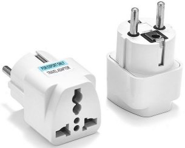
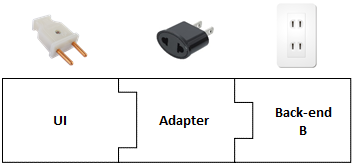
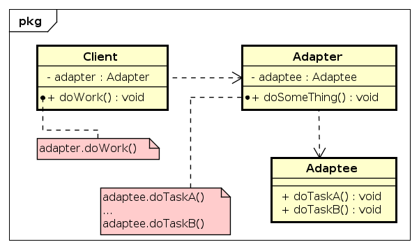
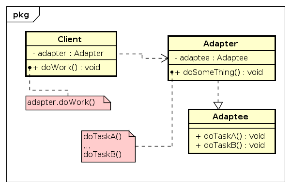

# Adapter

## 1. Context

 Hãy tưởng tượng bạn được đến châu Âu chơi và sau đó mua về 1 em Macbook làm cảnh. Chẳng may vui quá đà nên quên mất ko để ý là phích cắm điện của nó lại theo chuẩn EU, không vừa với mấy cái ổ cắm ở Việt Nam. Vậy lúc này bạn sẽ phải làm gì?

 

 Hiển nhiên là ở Việt Nam thì không có mấy cái ổ cắm tiêu chuẩn theo EU được rồi. Tuy nhiên, thật may là hiện tại cũng không thiếu các phích cắm chuyển đổi chân từ kiểu EU sang Việt Nam. Và bạn chỉ việc ra mấy cửa hàng điện nước mua 1 cái adapter về cắm giữa phích cắm của em Macbook với ổ cắm điện nhà bạn là xong.

 

 Trong nghiệp code cũng vậy, đôi khi có tình huống là project từ trước đến này đang dùng 1 backend A rất ngon lành cành đào. Anh em rất vui vẻ vì hệ thống đang hoạt động rất là ngon lành, user rất là thích thú. Chẳng may một ngày đẹp trời, backend A dính phải scandal về rò rỉ dữ liệu. Thế là tức tốc khách hàng gửi công điện khẩn yêu cầu chúng ta phải chuyển ngay sang dùng backend B để tránh sự cố kia kẻo có ngày mất khách hàng mà lại phải đền oan.

 Nhưng phải làm sao trong khi hệ thống đang chỉ thiết kế cho việc sử dụng backend A, trong khi backend B kia lại làm việc theo kiểu hoàn toàn khác? Chả lẽ code lại từ đầu? Thế thì biết bao giờ mới xong? Mà đến lúc code xong thì lại phải test lại nữa. Tiền của đâu mà đổ vào bây giờ?

 

 Vậy là anh em nghĩ ngay ra giải pháp như với em Macbook trên kia. Làm ngay 1 module trung gian với nhiệm vụ nhận yêu cầu từ UI và chuyển đến backend B, sau đó nhận lại kết quả từ backend B rồi forward đến cho UI.

 

 ==> Vậy là bài toán đã được giải quyết. Đó chính là nguyên lý căn bản của __*Adapter Pattern*__

## 2. Advantage

- Với các module có interface khác nhau và không thể giao tiếp được với nhau. Adapter có thể làm cầu nối để chúng có thể hoạt động cùng nhau.
- Tăng tính tái sử dụng của lib, module.
- Phạm vi ảnh hưởng cũng nhỏ hơn khi cần phải thay đổi một module nào đó

## 3. How to do

Thành phần của Adapter pattern bao gồm:

- __Adaptee__: là module không phù hợp với hệ thống cần được tích hợp.
- __Adapter__: là module trung gian giữa module cần tích hợp và hệ thống, chính là phần mà ta cần tạo ra theo pattern này. Đây là thành phần chính trong Adapter pattern giúp chuyển đổi API phù hợp theo yêu cầu hệ thống và module cần tích hợp.
- __Client__: là code ứng dụng hệ thống của chúng ta.

### 3.1 Object Adapter

 B1: Khi tạo Adapter theo dạng này, Adapter sẽ tạo một object member có kiểu là Adaptee.

 B2: Sau đó, ta tạo các API có đầu vào phù hợp với hệ thống có sẵn.
 
 B3: Cuối cùng, ta call đến các API của Adaptee theo object của Adaptee mà nó đang nắm giữ.

 

### 3.2 Class Adapter

B1: Đối với Adapter theo dạng class, thì ta sử dụng phương pháp kế thừa lại Adaptee.

B2: Ta cũng tạo các API với đầu vào phù hợp với hệ thống.

B3: Tiếp đến là tuỳ theo từng API thì ta call đến các method phù hợp của Adaptee.

 

## 4. Issue

- Đôi khi các request phải thông qua một chuỗi các adapter rời mới đến đích xử lý thực sự.
- Tất cả các request đều phải forward qua Adapter, điều này làm tăng thêm một chút chi phí khi sử dụng API.
